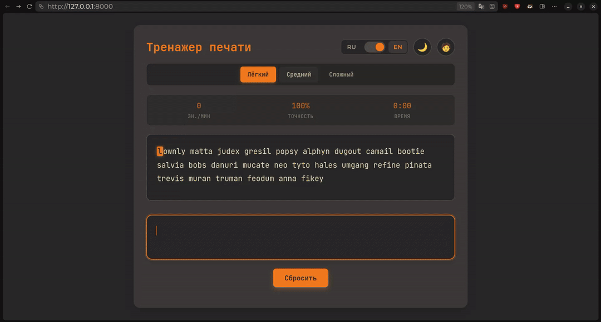

# TypeFast 🚀

**TypeFast** — это веб-приложение для проверки скорости печати с генерацией текста из словаря, поддержкой русского и английского языков для печати, различными уровнями сложности, с профилем пользователя где есть детальная статистика с графиками.



## 📚 Содержание

1. [📱 О проекте](#-о-проекте)
2. [🛠️ Стек технологий](#️-стек-технологий)
3. [🏗️ Архитектура приложения](#️-архитектура-приложения)
4. [📁 Структура проекта](#-структура-проекта)
5. [🔧 Основные компоненты](#-основные-компоненты)
6. [📥 Инструкции по установке](#-инструкции-по-установке)
7. [🐳 Docker инструкции](#-docker-инструкции)
8. [🔌 API примеры](#-api-примеры)
9. [🧪 Тестирование](#-тестирование)
10. [📸 Скриншоты и видео](#-скриншоты-и-видео)
11. [🚀 Roadmap/Возможные улучшения](#-roadmapвозможные-улучшения)
12. [📞 Контакты и ссылки](#-контакты-и-ссылки)

---
## 📱 О проекте

**TypeFast** — это интерактивный инструмент, который помогает пользователям улучшать свои навыки печати. Он предоставляет возможность тестирования скорости и точности печати с использованием случайно сгенерированного текста. Приложение поддерживает два языка и три уровня сложности, что делает его подходящим как для новичков, так и для опытных пользователей.

## Ключевые возможности:
- ✅ Генерация текста из случайных слов из словаря
- ✅ 3 уровня сложности (easy, medium, hard)
	- **Easy**: короткие слова, минимум пунктуации
	- **Medium**: средние слова, стандартная пунктуация
	- **Hard**: длинные слова, много пунктуации
- ✅ Поддержка 2 языков: русский и английский
- ✅ Автоматическое создание профиля при первом тесте
- ✅ Статистика пользователя:
	- Последний результат
	- Средние показатели
	- Лучшие показатели
- ✅ 2 интерактивных графика:
	- График точности (accuracy) по всем тестам
	- График скорости печати (chars per minute) по всем тестам

---
## 🛠️ Стек технологий

| Технология | Версия | Назначение |
|---|---|---|
| **Python** | 3.13 | Язык программирования |
| **FastAPI** | 0.118.0 | REST API framework |
| **SQLAlchemy** | 2.0.44 | ORM для работы с БД (используется SQLite) |
| **Pydantic** | 2.11.10 | Валидация данных |
| **SQLite** | 3.50.2 | Встраиваемая база данных |
| **JavaScript** | ES6+ | Логика фронтенда |
| **Pytest** | 8.4.2 | Тестирование |
| **Docker** | 28.5.2 | Контейнеризация |
| **Docker Compose** | 2.40.2 | Контейнеризация |
| **HTML5** | - | Разметка |
| **CSS3** | - | Стили |


---
## 🏗️ Архитектура приложения

Приложение построено по принципам MVC, что позволяет разделить бизнес-логику, представление и работу с данными. 

### Основные компоненты:
- **Routes**: API endpoints
- **Schemas**: Pydantic модели
- **Models**: SQLAlchemy модели
- **Repositories**: Работа с БД
- **Services**: Бизнес-логика

---
## 📁 Структура проекта

  ```markdown
  TypeFast/
  │
  ├── 📦 backend/
  │   ├── 📁 app/
  │   │   ├── 🔌 api/
  │   │   │   └── routes.py                 # API endpoints
  │   │   │
  │   │   ├── ⚙️ core/
  │   │   │   ├── config.py                 # Конфигурация приложения
  │   │   │   ├── config_test.py            # Конфигурация тестов
  │   │   │   ├── exceptions.py             # Custom исключения
  │   │   │   └── logger.py                 # Логирование
  │   │   │
  │   │   ├── 🗄️ db/
  │   │   │   ├── database.py               # Подключение к БД
  │   │   │   ├── models.py                 # SQLAlchemy модели
  │   │   │   ├── repositories.py           # Работа с данными
  │   │   │   └── dependencies.py           # Зависимости FastAPI
  │   │   │
  │   │   ├── 📋 schemas/
  │   │   │   ├── db_schemas.py             # Pydantic модели БД
  │   │   │   ├── text_schemas.py           # Схемы для текста
  │   │   │   └── progress_schemas.py       # Схемы прогресса
  │   │   │
  │   │   ├── 🛠️ services/
  │   │   │   ├── word_extractor.py         # Извлечение слов
  │   │   │   ├── progress_calculator.py    # Расчет статистики
  │   │   │   └── utils.py                  # Утилиты
  │   │   │
  │   │   ├── 📚 words_data/
  │   │   │   ├── russian_words.txt         # Русский словарь на 1.5м слов
  │   │   │   ├── words_alpha.txt           # Английский словарь
  │   │   │   └── singular_and_plural.txt   # Русский словарь на 125к слов
  │   │   │
  │   │   └── main.py                       # Точка входа приложения
  │   │
  │   ├── 🧪 tests/
  │   │   ├── conftest.py                   # Конфигурация pytest
  │   │   ├── test_routes.py                # Тесты API
  │   │   ├── test_repositories.py          # Тесты БД
  │   │   ├── test_word_extractor.py        # Тесты извлечения слов
  │   │   └── test_progress_calculator.py   # Тесты расчетов
  │   │
  │   ├── 🔄 migrations/
  │   │   ├── env.py                        # Конфиг миграций Alembic
  │   │   ├── script.py.mako                # Шаблон миграций
  │   │   └── versions/                     # История миграций
  │   │
  │
  ├── 🎨 frontend/
  │   ├── 🌐 html/
  │   │   ├── index.html                    # Главная страница (тест)
  │   │   └── statistics.html               # Страница профиля
  │   │
  │   ├── 🎭 css/
  │   │   ├── style.css                     # Стили главной страницы
  │   │   └── statistics-style.css          # Стили профиля
  │   │
  │   └── ⚡ js/
  │       ├── script.js                     # Логика теста печати
  │       └── user-statistics.js            # Логика профиля и графиков
  │
  ├── 🐳 docker-compose.yml                 # Docker Compose конфиг
  ├── 📋 Dockerfile                         # Docker образ
  ├── ⚙️ alembic.ini                        # Конфиг Alembic
  ├── 🧪 pytest.ini                         # Конфиг pytest
  ├── 📦 requirements.txt                   # Зависимости проекта
  ├── 📖 README.md                          # Документация
  └── 🚫 .gitignore                         # Git исключения
  ```
---
## 🔧 Основные компоненты

### 🔙 Backend
- **FastAPI**: используется для создания RESTful API.
- **SQLAlchemy**: ORM для работы с базой данных.
- **Pydantic**: для валидации данных и сериализации.
- **SQLite**: для хранения данных.
- **Pytest**: для тестирования приложения.

### 🎨 Frontend
- **HTML5, CSS3, JavaScript**: используется для создания пользовательского интерфейса без фреймворков, что упрощает код и увеличивает производительность.

---
## 📥 Инструкции по установке

### 🔄 Шаг 0: Клонирование репозитория (для обоих способов)
```bash
git clone https://github.com/Nu-nik-kak-nik/TypeFast.git
cd TypeFast
```

### Способ 1: Локальный запуск (без Docker)

1. **Создайте и активируйте виртуальное окружение**:

- Для создания виртуального окружения выполните команду:

```bash
python -m venv venv
```

- Активируйте виртуальное окружение:

	На Windows:

	```bash
	venv\Scripts\activate
	```

	На macOS и Linux:

	```bash
	source venv/bin/activate
	```

2. **Установите зависимости**:

```bash
pip install -r requirements.txt
```

3. **Запустите приложение**:

Либо через uvicorn напрямую:

```bash
uvicorn backend.app.main:app --host 0.0.0.0 --port 8000
```

Либо через main.py:

```bash
python backend/app/main.py
```

Приложение будет доступно по адресам:

- 🌐 Фронтенд: http://localhost:8000
- 🔌 API: http://localhost:8000/api
- 📚 API документация: http://localhost:8000/docs

---
## 🐳 Способ 2: Запуск с Docker

### ⚡ Быстрый старт

Запустить приложение **одной командой**:

```bash
docker-compose up --build
```

Последующие запуски:

```bash
docker-compose up
```

Приложение будет доступно по адресам:

- 🌐 Фронтенд: http://localhost:8080
- 🔌 http://localhost:8080/api/
- 📚 API документация: http://localhost:8080/docs

---
### 🛑 Остановка приложения

**Остановить контейнеры (данные сохраняются):**

```bash
docker-compose stop
```

**Остановить и удалить контейнеры (данные сохраняются):**

```bash
docker-compose down
```

**Полная очистка (удалить всё, включая данные):**

```bash
docker-compose down -v
```

---

### 📊 Просмотр логов

**Логи всех сервисов:**

```bash
docker-compose logs
```

**Логи конкретного сервиса:**

```bash
docker-compose logs typefast
docker-compose logs nginx
```

---
## 🔌 API примеры

### 📖 Получение текста для тестирования

```bash
curl -X 'GET' \
'http://127.0.0.1:8000/api/text?lang=ru&difficulty=easy' \
-H 'accept: application/json'
```

### 💾 Сохранение результата теста

```bash
  curl -X 'POST' \
  'http://127.0.0.1:8000/api/test-result' \
  -H 'accept: application/json' \
  -H 'Content-Type: application/json' \
  -d '{
    "user_id": "fd891090-a10c-484a-ad24-329d32b5d5cb",
    "chars_per_minute": 176,
    "accuracy": 97,
    "time_seconds": 54,
    "language": "ru",
    "difficulty": "easy"
  }'
```

### 👤 Получение профиля пользователя

```bash
  curl -X 'GET' \
  'http://127.0.0.1:8000/api/statistics/fd891090-a10c-484a-ad24-329d32b5d5cb' \
  -H 'accept: application/json'
```

---
## 🧪 Тестирование

Проект использует **pytest** для автоматизированного тестирования backend компонентов.
	
### ⚡ Быстрый старт

**Запустить все тесты**
```bash
  pytest
```

**Запустить с подробным выводом**
```bash
  pytest -v
```

**Запустить конкретный файл тестов**
```bash
  pytest backend/app/tests/test_routes.py
```

**Запустить с покрытием кода**
```bash
  pytest --cov=backend/app
```

---
### 📋 Структура тестов

| Файл | Тестирует |
|---|---|
| `test_routes.py` | API endpoints и маршруты |
| `test_repositories.py` | Работу с БД и репозиториями |
| `test_word_extractor.py` | Генерацию текста и словарь |
| `test_progress_calculator.py` | Расчет статистики и метрик |

---
## 📸 Скриншоты и видео

  🖼️ **Скриншоты:**
- [СКРИНШОТ: Главная страница с тестом]
- [СКРИНШОТ: Процесс печати текста]
- [СКРИНШОТ: результаты после теста]
- [СКРИНШОТ: Профиль пользователя]
- [СКРИНШОТ: Графики статистики]

  🎥 **Видео:**
- [ВИДЕО: Демонстрация полного прохождения теста]
- [ВИДЕО: Переключение между языками/сложностями и смена темы]
- [ВИДЕО: Навигация по профилю]

---
## 🚀 Roadmap/Возможные улучшения
- Добавление новых настроек сложности
- Поддержка дополнительных языков
- Улучшение интерфейса пользователя
- Поддержка других языков в интерфейсе
- Расширенные функции анализа статистики
- Аутентификация — регистрация и вход через Google/GitHub

---
## 📞 Контакты и ссылки
- [GitHub профиль автора](https://github.com/Nu-nik-kak-nik)
- [Ссылка на проект](https://github.com/Nu-nik-kak-nik/TypeFast/tree/main)